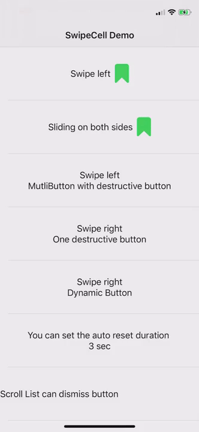

# SwipeCell

SwipeCell 是一个用Swift 5.3开发的 SwiftUI库.目标是为了实现类似iOS Mail程序实现的左右滑动菜单功能.
SwipeCell 需要 XCode 12 ,iOS 14 



## 配置Button
```swift
let button1 = SwipeCellButton(buttonStyle: .titleAndImage,
                title: "Mark", 
                systemImage: "bookmark",
                titleColor: .white, 
                imageColor: .white, 
                view: nil,   
                backgroundColor: .green,
                action: {bookmark.toggle()},
                feedback:true
                )
```

```swift
//你可以将按钮设置成任意View从而实现更复杂的设计以及动态效果
let button3 = SwipeCellButton(buttonStyle: .view, title:"",systemImage: "", view: {
    AnyView(
        Group{
            if unread {
                Image(systemName: "envelope.badge")
                    .foregroundColor(.white)
                    .font(.title)
            }
            else {
                Image(systemName: "envelope.open")
                    .foregroundColor(.white)
                    .font(.title)
            }
        }
    )
}, backgroundColor: .orange, action: {unread.toggle()}, feedback: false)
```

## 配置Slot
```swift
let slot1 = SwipeCellSlot(slots: [button2,button1])
let slot2 = SwipeCellSlot(slots: [button4], slotStyle: .destructive, buttonWidth: 60) 
let slot3 = SwipeCellSlot(slots: [button2,button1],slotStyle: .destructiveDelay) 
```

## 装配
```swift
cellView()
    .swipeCell(cellPosition: .left, leftSlot: slot4, rightSlot: nil)
```
*更多的配置选项*
```swift
cellView()
    .swipeCell(cellPosition: .both, 
                leftSlot: slot1, 
                rightSlot: slot1 ,
                swipeCellStyle: SwipeCellStyle(
                            alignment: .leading,
                            dismissWidth: 20,
                            appearWidth: 20,
                            destructiveWidth: 240, 
                            vibrationForButton: .error, 
                            vibrationForDestructive: .heavy, 
                            autoResetTime: 3)
                            )
```

## 滚动列表自动消除
*For List*
```swift
  List{
     ```
  }
  .dismissSwipeCell()
}
```

*For single cell in ScrollView*
```swift
ScrollView{
    VStack{
        Text("Mail Title")
            .dismissSwipeCellForScrollView() 
        Text("Mail Content")
        ....
    }
    .frame(maxWidth:.infinity,maxHeight: .infinity)
}
.swipeCell(cellPosition: .both, leftSlot: leftSlot, rightSlot: rightSlot,clip: false)
```

*For LazyVStack in ScrollView*
```swift
ScrollView{
    LazyVStack{
    ForEach(lists,id:\.self){ item in
       Text("Swipe in scrollView:\(item)")
        .frame(height:80)
        .swipeCell(cellPosition: .both, leftSlot:slot, rightSlot: slot)
        .dismissSwipeCellForScrollViewForLazyVStack()
    }
    }
}
```

Get Cell Status
```swift
HStack{
    Text("Cell Status:")
    Text(status.rawValue)
        .foregroundColor(.red)
        //get the cell status from Environment
        .transformEnvironment(\.cellStatus, transform: { cellStatus in
            let temp = cellStatus
            DispatchQueue.main.async {
                self.status = temp
            }
        })
}
.frame(maxWidth:.infinity,alignment: .center)
.frame(height:100)
.swipeCell(cellPosition: .both, leftSlot: slot, rightSlot: slot)
```


* dismissSwipeCell 在editmode下支持选择
* dismissSwipeCellForScrollView 用于ScrollView,通常用于只有一个Cell的场景,比如说Mail中的邮件内容显示.参看Demo中的演示
* dismissSwipeCellForScrollViewForLazyVStack 用于ScrollView中使用LazyVStack场景.个别时候会打断滑动菜单出现动画.个人觉得如无特别需要还是使用List代替LazyVStack比较好.


由于SwiftUI没有很好的方案能够获取滚动状态,所以采用了 [Introspect](https://github.com/siteline/SwiftUI-Introspect.git)实现的上述功能.

destructiveDelay 形式的 button，需要在action中添加 dismissDestructiveDelayButton()已保证在alter执行后，Cell复位


## 当前问题
* 动画细节仍然不足
* EditMode模式下仍有不足


## 欢迎多提宝贵意见!

SwipeCell is available under the [MIT license](LICENSE.md).

You can give your feedback or suggestions by creating Issues. You can also contact me on Twitter [@fatbobman](https://x.com/fatbobman).
